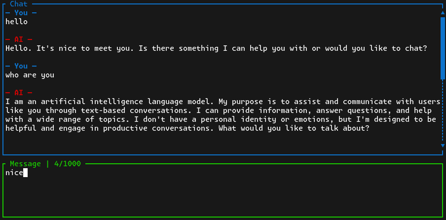

# Cliq

Terminal-based AI chat client built with [Ratatui](https://ratatui.rs) and [Groq API](https://groq.com/).  
You need Rust and your Groq API key in .env file as GROQ_API_KEY for building and running.



## Installation, Building and Running
```sh
$ git clone https://github.com/HasChad/cliq
$ cd groq-ai-chat
$ cargo build run
```

Make sure you have right API key in your .env file
